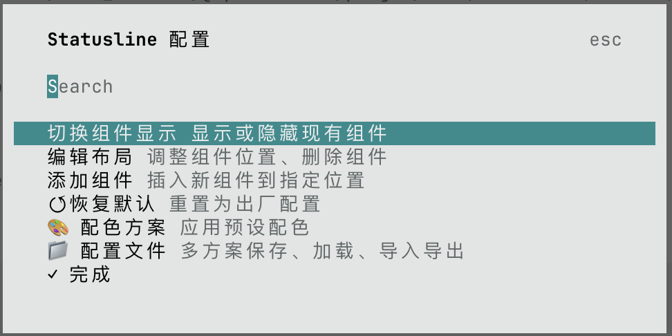
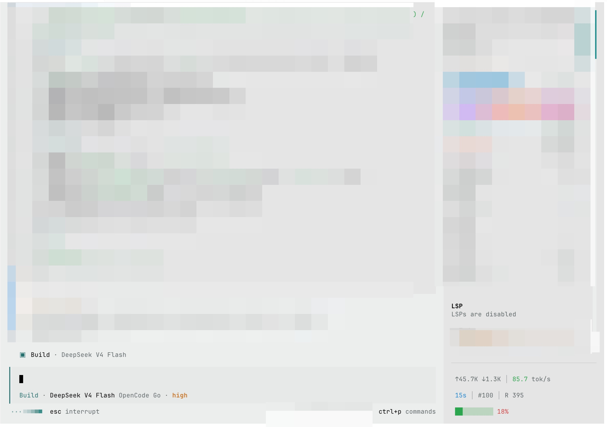

# opencode-statusline

A real-time session status bar for the opencode TUI sidebar footer.

Inspired by [ccstatusline](https://github.com/sirmalloc/ccstatusline) for Claude Code.

## Screenshots

| Configuration panel | Live sidebar |
|:---:|:---:|
|  |  |

## Features

- **Real-time stats** — tokens, cost, speed, context usage, reasoning tokens, cache hit rate
- **Live streaming speed** — 5s rolling window during generation, average per message when idle
- **Widget system** — add, remove, reorder, and color individual widgets per your preference
- **Multi-line layout** — arrange widgets into multiple rows
- **Color presets** — 4 built-in themes (default, vivid, soft, clean)
- **Config profiles** — save and switch between multiple named configurations
- **Export/Import** — backup or share your config as JSON
- **Full TUI configuration** — `/statusline` slash command with interactive dialog panels

## Available Widgets

| Widget | Description |
|--------|-------------|
| `model` | Current AI model name |
| `tokens` | Total tokens consumed (input + output + reasoning) |
| `cost` | Total session cost in USD |
| `speed` | Real-time generation speed (tok/s) |
| `duration` | Session elapsed time |
| `context-pct` | Context window usage percentage |
| `context-bar` | Visual progress bar for context usage (green → yellow → red) |
| `git-branch` | Current git branch |
| `reasoning` | Reasoning tokens used |
| `cache-write` | Cache write tokens |
| `cache-hit-rate` | Cache hit rate with progress bar |
| `total-tokens` | Total tokens across all categories |
| `messages` | Message count in current session |
| `separator` | Visual separator |
| `text` | Custom text label |

## Installation

### Global (recommended)

Run `/statusline-global` inside an opencode session that already has the plugin loaded.
This copies the plugin to `~/.config/opencode/plugins/` and registers it in the global `tui.json`,
making it available in all projects.

### Per-project

1. **Copy the plugin file** to your project's `.opencode/plugins/`:

```sh
cd /path/to/your/project
cp path/to/opencode-statusline/.opencode/plugins/opencode-statusline.tsx .opencode/plugins/
```

2. **Add dependencies** to your project's `.opencode/package.json`:

```sh
cd .opencode
npm install solid-js @opentui/core @opentui/solid
```

3. **Register the plugin** in your `tui.json`:

```json
{
  "$schema": "https://opencode.ai/tui.json",
  "plugin": ["./.opencode/plugins/opencode-statusline.tsx"]
}
```

4. **Restart opencode.**

Open the config panel at any time with the `/statusline` command.

## Configuration

Configure interactively via `/statusline`, or set defaults in `tui.json`:

```json
{
  "plugin": [["./.opencode/plugins/opencode-statusline.tsx", {
    "lines": [[
      { "type": "model", "color": "accent", "bold": true },
      { "type": "separator" },
      { "type": "tokens", "color": "default" }
    ], [
      { "type": "cost" },
      { "type": "separator" },
      { "type": "speed", "color": "muted" },
      { "type": "separator" },
      { "type": "git-branch", "color": "info" }
    ]]
  }]]
}
```

**Priority:** `tui.json` options > `api.kv` > built-in defaults.

`color` supports: theme names (`default`, `muted`, `accent`, `success`, `warning`, `error`, `info`), 16-color names, xterm-256 color numbers, and hex codes (`#RRGGBB`).

## Development

```sh
# Typecheck
cd .opencode && npx tsc --noEmit

# Test in a headless TUI
script -q /tmp/oc-test.txt sh -c 'stty cols 200 rows 50; opencode -c'
```

## License

MIT
